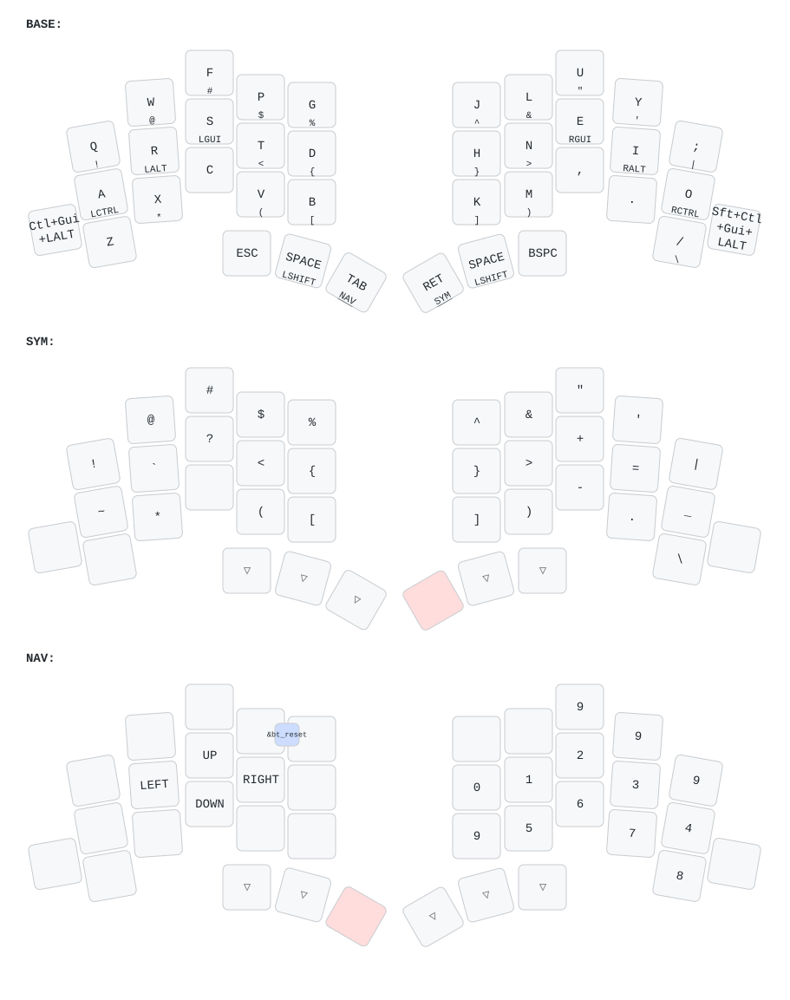

<picture>
  <source media="(prefers-color-scheme: dark)" srcset="/docs/images/TOTEM_logo_dark.svg">
  <source media="(prefers-color-scheme: light)" srcset="/docs/images/TOTEM_logo_bright.svg">
  
</picture>

# ZMK CONFIG FOR THE TOTEM SPLIT KEYBOARD

[Here](https://github.com/GEIGEIGEIST/totem) you can find the hardware files and build guide.\
[Here](https://github.com/GEIGEIGEIST/qmk-config-totem) you can find the QMK config for the TOTEM.

TOTEM is a 38 key column-staggered split keyboard running [ZMK](https://zmk.dev/) or [QMK](https://docs.qmk.fm/). It's meant to be used with a SEEED XIAO BLE or RP2040.

[]()


## HOW TO USE

- fork this repo
- `git clone` your repo, to create a local copy on your PC (you can use the [command line](https://www.atlassian.com/git/tutorials) or [github desktop](https://desktop.github.com/))
- adjust the totem.keymap file (find all the keycodes on [the zmk docs pages](https://zmk.dev/docs/codes/))
- `git push` your repo to your fork
- on the GitHub page of your fork navigate to "Actions"
- scroll down and unzip the `firmware.zip` archive that contains the latest firmware
- connect the left half of the TOTEM to your PC, press reset twice
- the keyboard should now appear as a mass storage device
- drag'n'drop the `totem_left-xiao_ble_nrf52840_zmk-zmk.uf2` file from the archive onto the storage device
- repeat this process with the right half and the `totem_right-xiao_ble_nrf52840_zmk-zmk.uf2` file.
- The keymap image was generated using https://keymap-drawer.streamlit.app/ and loading the `totem.keymap` file under the 'Parse from ZMK keymap' button.
  The same tool can be run locally, which regenerates `docs/images/keymap.svg` in place:
  ```
  uvx --from keymap-drawer keymap parse -z config/totem.keymap | uvx --from keymap-drawer keymap draw - > docs/images/keymap.svg
  ```

## RECOVERY

If the halves stop talking to each other, or a host offers CONNECT but never
actually connects, flash the settings reset firmware. It erases the entire
settings partition at boot: every host BLE profile, the split pairing bond and
the saved output preference.

- put **both** halves into bootloader mode (double-tap reset)
- drag `settings_reset-xiao_ble_nrf52840_zmk-zmk.uf2` onto **one** half, then the other
- flash the normal `totem_left` / `totem_right` UF2s back onto their respective halves
- reset both halves at roughly the same time so they re-pair
- "Forget This Device" on every host, then pair again

The reset firmware has Bluetooth disabled on purpose, so a half running it will
not appear in any Bluetooth device list. That is expected, not a failure.

A successful UF2 flash makes the mass-storage volume eject and disappear on its
own. If the drive is still mounted afterwards, the write did not take.
